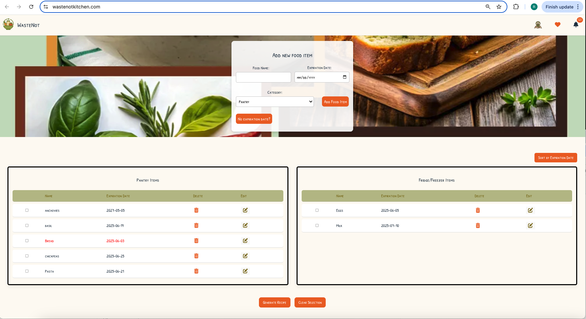

# Project Title

WasteNot - An app to reduce food waste in every kitchen

## Description

Our app is inspired by one simple principle - we hate food waste! It is estimated that food waste accounts for 30%-40% of the United States food supply. Of that, almost half is thrown away in our own homes. Not only is this a huge waste of resources (one pound of food waste per person per day), it's also expensive (about $700 per person each year)! WasteNot provides a simple solution to help combat this problem - keep track of all your food items in one location, monitor their expiration dates, and get recipes for ingredients you need to use soon. You can also favorite recipes to refer back to at a later time. If a food item is no longer edible, WasteNot provides helpful tips for composting at home or finding a composting location near you. By making the process easy and accessible to all users, we hope that we can make a dent in this pressing global issue.

### Technology Stack

| Category   | Technologies Used |
| ---------- | ----------------- |
| Backend    | Python, FastAPI   |
| Database   | PostgreSQL        |
| Frontend   | React, JavaScript |
| Deployment | Docker, Render    |

## Getting Started

### Dependencies

Found in the requirements.txt, package.json, and package-lock.json files

### Installing

Database:

- Start Docker: `docker compose up -d`
- Access PostgreSQL container: `docker exec -it postgres_db psql -U postgres`
- Connect to database: `\c pantry`
- Load schema: `\i data/pantry.sql`

Backend:

- Install from requirements: `pip install -r requirements.txt`
- Run dev server: `fastapi dev main.py` or `uvicorn main:app --reload`

Frontend:

- Install dependencies: `npm install`
- Start dev server: `npm run dev`

### Executing program

- View page at http://localhost:5173/

- You will need to get a Spoonacular API key at https://spoonacular.com/food-api/console#Dashboard. Add the key to the .env file in the server folder.

- You will also need to get a Google Maps API key at https://developers.google.com/maps/documentation/javascript/get-api-key. Add the key to the .env file in the client folder.

- Our production app is hosted through Render at https://wastenot-frontend-e09l.onrender.com. Our domain name is https://www.wastenotkitchen.com.

## Help

- If you get an error when you try to retrieve recipes, it's probably because you hit the daily quota for the Spoonacular API.
- If the error persists, try killing the backend server and running `export $(cat .env | xargs)` before restarting with `uvicorn main:app --reload`

## Authors

- Jonathan Kwan/
  jkwan14@gmail.com/
  https://github.com/jkwan14

- Lindsey Lawson/
  lawsonlindsey36@yahoo.com/
  https://github.com/lil2319

- Rebecca Loewenstein-Harting/
  rebeccalh01@gmail.com/
  https://github.com/rebeccalh01

- Kimmi Wong/
  kimmiwong94@gmail.com/
  https://github.com/kimmiwong

## Version History

## License

## Acknowledgments

- Spoonacular API: https://spoonacular.com/food-api/
- Google Maps API: https://developers.google.com/maps
